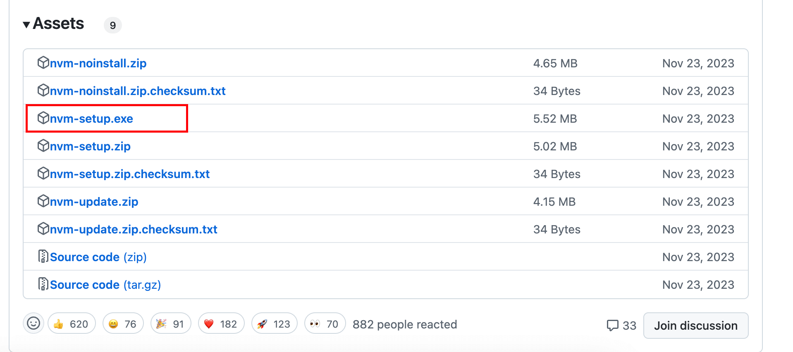
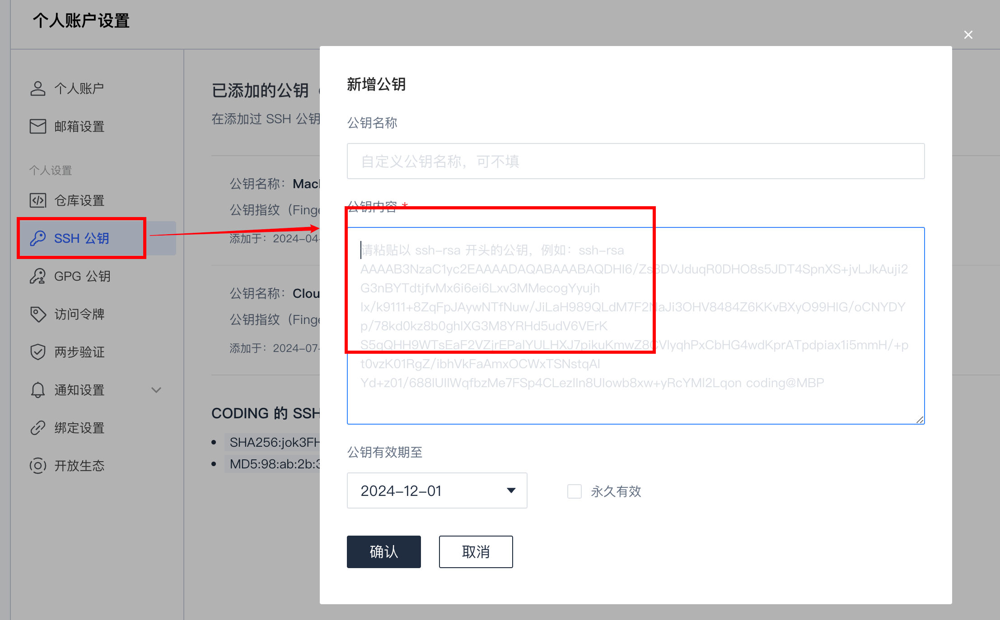

# 前端开发环境搭建 - Windows

> `macOS` 操作系统请看 [前端开发环境搭建 - macOS](./setup-macos.md)

:::info 信息
在前端开发的世界， `macOS` 在大多数时候可以提供更加舒适和标准化的编程环境。
:::

在开始前，使用 Windows 的开发同学需要对 Windows 操作系统的**环境变量**有一个清晰的认知，可以参考[【开发常识】以 win11 为例介绍环境变量](https://juejin.cn/post/7221769090833530917?searchId=20241003233457E70DDB9C7F4803F682C8)搞清楚环境变量、PowerShell、CMD 的含义。

如果安装过程中出现“**找不到命令**”之类的错误，请首先检查相关的软件有没有存在于环境变量的 `PATH` 中。

同时，建议不要人为地将软件 / SDK 等装在 C 盘，开发同学应该自行规划安装位置并记住。

:::tip 提示
由于种种原因，在中国大陆访问 Github 等国外站点会比较不稳定，为了确保后面的流程顺利进行，你应该先尝试建立好**科学上网 🪜**的环境。
:::

[[TOC]]

## 1. 安装 SDK 和 IDE

总的来说，有这些：

- VSCode：https://code.visualstudio.com/
- git：https://git-scm.com/downloads
- 微信开发者工具：https://developers.weixin.qq.com/miniprogram/dev/devtools/download.html
- 谷歌浏览器：https://www.google.com/intl/en_hk/chrome/
- [可选] snipaste（截图工具）：https://zh.snipaste.com/

Windows 下需要去官网下载安装包，具体安装步骤详见各自官网。

## 2. 搭建 Node.js 环境

推荐使用 `nvm-windows` 进行 `Node.js` 版本管理和安装，便于后续切换 `Node.js` 版本。

:::warning 提醒
如果你之前已经安装过 `Node.js`，并且没有把握解决安装 nvm 后潜在的冲突问题，则最好要**先卸载干净**原先的 `Node.js`，包括检查并清理**环境变量**中关于 `Node.js` 和 `npm` 的配置。

运行下面的指令，如果报错了则说明 `Node.js` 已经不存在了

```bash
node -v
```

:::

### 2.1 安装 nvm-windows

在 [Github](https://github.com/coreybutler/nvm-windows/releases/) 上下载并安装最新的 release 包



验证安装：

```bash
nvm -v
```

不报错且正常输出版本信息则为成功。

以下是一些常用的 nvm 指令

```bash
nvm list                 ##是查找本电脑上所有的node版本
    - nvm list     ##查看已经安装的版本
    - nvm list installed ##查看已经安装的版本
    - nvm list available ##查看网络可以安装的版本

nvm install    ##安装指定版本node
nvm uninstall  ##卸载制定的版本
nvm install stable             ## 安装最新稳定版 node，当前是node v9.5.0 (npm v5.6.0)
nvm install      ##安装指定版本，可模糊安装，如：安装v4.4.0，既可nvm install v4.4.0，又可nvm install 4.4

nvm use              ##切换使用指定的版本node
nvm -v                                     ##查看当前的版本

nvm ls                                     ## 列出所有安装的版本
nvm ls-remote                     ## 列出所有远程服务器的版本（官方node version list）
nvm current                          ## 显示当前的版本

nvm use [version] [arch] ##切换制定的node版本和位数
```

### 2.2 安装 Node.js

使用刚才安装的 `nvm-windows` 来安装 `Node.js`

对于综测项目来说，只需要安装 `Node.js v20` 即可。

```bash
# 下载 v20.x 版本
nvm install 20
# nvm-windows 暂时不支持 alias
nvm use 20
```

安装成功后，可以查看当前的 `Node.js` 版本

```bash
node -v
npm -v
```

### 2.3 npm 换源

npm 默认源 `https://registry.npmjs.org` 在大陆访问速度较慢，可以换成国内的其他 CDN 源。

下面挑一个你喜欢的源来换

```bash
# 淘宝源
npm config set registry https://registry.npmmirror.com/
# 腾讯源
npm config set registry https://mirrors.tencent.com/npm/
# 换回官方默认源
npm config set registry https://registry.npmjs.org/
```

### 2.4 安装 npm 全局包

总的来说有这些全局包要安装：

- pnpm：包管理器
- whistle：代理和抓包工具
- envinfo：查看当前环境

```bash
npm install -g pnpm whistle envinfo
```

验证安装：

```bash
pnpm -v
w2 --version
envinfo --system --binaries --browsers
```

最后一行命令（`envinfo --system --binaries --browsers`）用于查看当前开发环境


## 3. Git 配置

在开始和团队其他同学协作前，需要先对本地的 Git 进行一些配置。

### 3.1 基础信息配置

```bash
# 设置用户名
git config --global user.name 你的Github/其他托管平台用户名
# 设置邮箱
git config --global user.email 你的Github/其他托管平台注册邮箱
```

### 3.2 SSH Key

:::info 信息
如果你已经配置过公私钥对，则可以忽略这一步
:::

无论是在 Github 还是 Coding 上进行代码协作，都需要在本机生成公私钥，然后在代码远程仓库中配置公钥。

下面介绍生成 RSA 公私钥对的方法，只需执行（将 mail@example.com 换成你注册 Github / Coding 用的邮箱）：

```bash
ssh-keygen -t rsa -C mail@example.com # 将 mail@example.com 换成你注册 Github/Coding 用的邮箱
```

一路回车，就可以在 `~/.ssh/` 下看到公私钥对：

- 公钥：id_rsa.pub
- 私钥：id_rsa

然后只需要将 ~/.ssh/id_rsa.pub 中的内容复制到 Github/Coding 中配置公钥即可



### 3.3 换行符切换成 LF

:::info 信息

- 在 `Windows` 中，换行符默认为 `\r\n`
- 在 `macOS` 中，换行符默认为 `\n`

:::

为了抹平不同操作系统的差异，一般团队内部项目都为使用 `.editorconfig` 和 `.gitattributes` 来限制换行符为 `\n`， Windows 下的开发同学需要对 Git 做一些配置来消除 Git 在 Windows 下 `pull` 或 `clone` 后会自动把换行符换成 `\r\n` 的影响。

下面的配置会让 Git 在提交时自动转换换行符为 `\n`，拉取时不做更改。

```bash
git config --global core.autocrlf input
```

## [可选] 美化终端

Windows 下的命令行环境比较不雅，想要改变或折腾终端的同学可以尝试下美化他。

一般可以使用 [Oh-My-Posh](https://ohmyposh.dev/)，打造一个看起来像 `macOS` 的命令行界面。具体配置方法参考[官网](https://ohmyposh.dev/docs/installation/windows)即可。

:::tip 提示
总的来说，安装和配置步骤大概有这些：

1. 安装 `oh-my-posh`，参考[这里](https://ohmyposh.dev/docs/installation/windows)
2. 通过 `oh-my-posh` 命令安装字体，参考[这里](https://ohmyposh.dev/docs/installation/fonts)
3. 挑选和配置你最爱的主题，参考[这里](https://ohmyposh.dev/docs/themes)

:::

## 小结

经过配置后，开发环境应该已经具备了下面的条件：

- VSCode，配置详见 [VSCode：100 倍研效提升](../devops/vscode.md)
- git，并做好了相关配置
- Node.js：通过 `nvm-windows` 管理
- 全局 npm 包：`pnpm`, `whistle`, `envinfo`